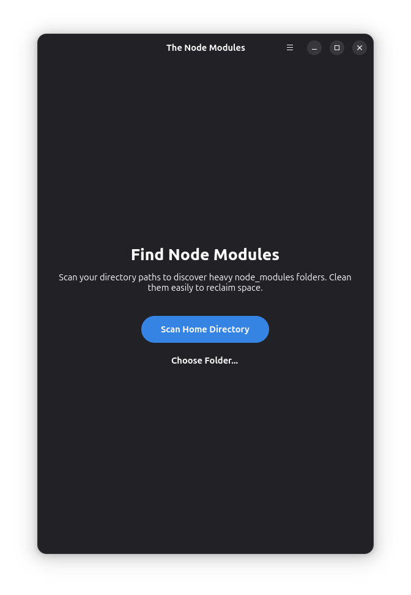
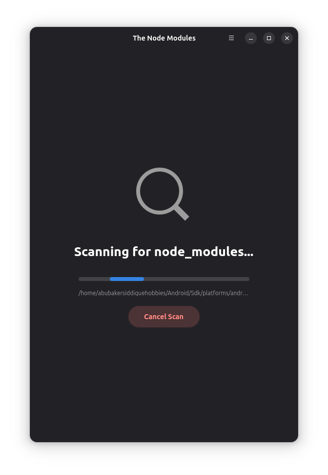
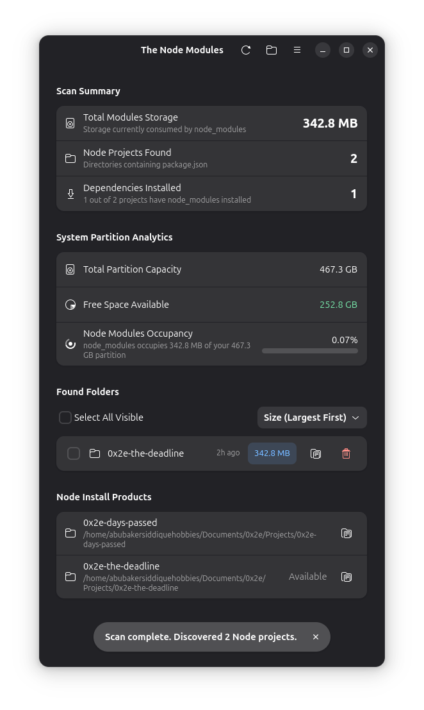
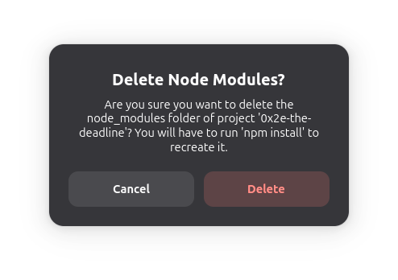
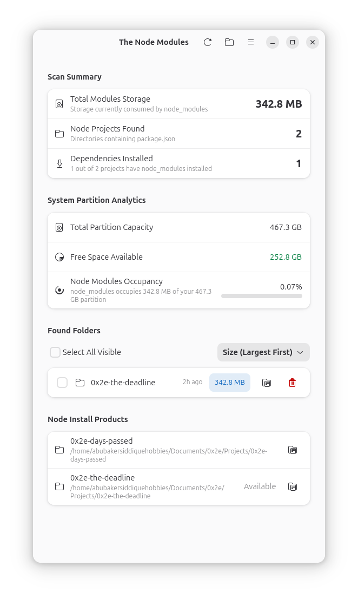

<p align="center">
  
</p>

<h1 align="center">The Node Modules Finder</h1>

<p align="center">
  <strong>A beautiful, native GNOME & Libadwaita application to scan, explore, and clean up heavy <code>node_modules</code> folders to instantly reclaim your disk space.</strong>
</p>

<p align="center">
  Official Project Home: <a href="http://0x1da49.com/0x6g"><strong>0x1da49.com/0x6g</strong></a>
</p>

---

## 📸 Screenshots & Walkthrough

### 1. Ready to Scan
A minimal, clean welcome page that integrates seamlessly with your desktop. Scan your home folder in one click or choose any custom directory.

<p align="center">
  
</p>

### 2. Live Scan Traversal
Watch the scanning engine work in real-time as a non-blocking background thread traverses all directories without causing any UI stutter.

<p align="center">
  
</p>

### 3. Comprehensive Dashboard & Explorer
Review partition space analytics, Node modules occupancy gauges, and your projects list. Under **Node Install Products**, you get a complete status report of all Node projects (`package.json`) regardless of whether dependencies are currently present or clean.

<p align="center">
  
</p>

### 4. Secure Bulk Deletion
Select multiple `node_modules` folders to clean and review them in a clean, confirmation action block before safe deletion.

<p align="center">
  
</p>

### 5. Native Day/Night Modes
Responsive native Libadwaita rendering that perfectly respects your system's light and dark preferences.

<p align="center">
  
</p>

---

## 🚀 Quick Installation

Install the secure, sandboxed Flatpak package directly on any Linux system:

### Option 1: One-Click Terminal Install (Recommended)
Copy and paste this single command into your terminal to automatically download and install the latest release:

```bash
curl -L -o com.x1da49.thenodemodules.flatpak https://github.com/abubakerx1da49/0x6g-the-node-modules/releases/latest/download/com.x1da49.thenodemodules.flatpak && flatpak install --user ./com.x1da49.thenodemodules.flatpak
```

### Option 2: Graphical Install
1. Download the standalone bundle from our [GitHub Releases](https://github.com/abubakerx1da49/0x6g-the-node-modules/releases) (the `.flatpak` asset).
2. **Double-click** the downloaded file to launch your system's App Store (GNOME Software / Discover) and click **Install**.

---

## ✨ Features

* **Lightning Fast concurrent scanning** using non-blocking background threads.
* **Disk Analytics** displaying partition capacities, free space, and Node Modules occupancy ratios.
* **Dual Cleanup & Project Explorer Views**:
  * **Cleanup View**: Select and purge heavy `node_modules` in bulk to reclaim storage.
  * **Node Install Products Explorer**: A secondary list showing all Node projects (`package.json`) and their active installation status.
* **Fluid GNOME Native UI** built strictly on GTK4 & Libadwaita following HIG guidelines.

---

## 🛠️ Local Development & Build

To compile and run the application locally on your machine:

```bash
# Build and install the Flatpak package locally
flatpak-builder --force-clean --user --install build-dir com.x1da49.thenodemodules.json

# Launch the application
flatpak run com.x1da49.thenodemodules
```
